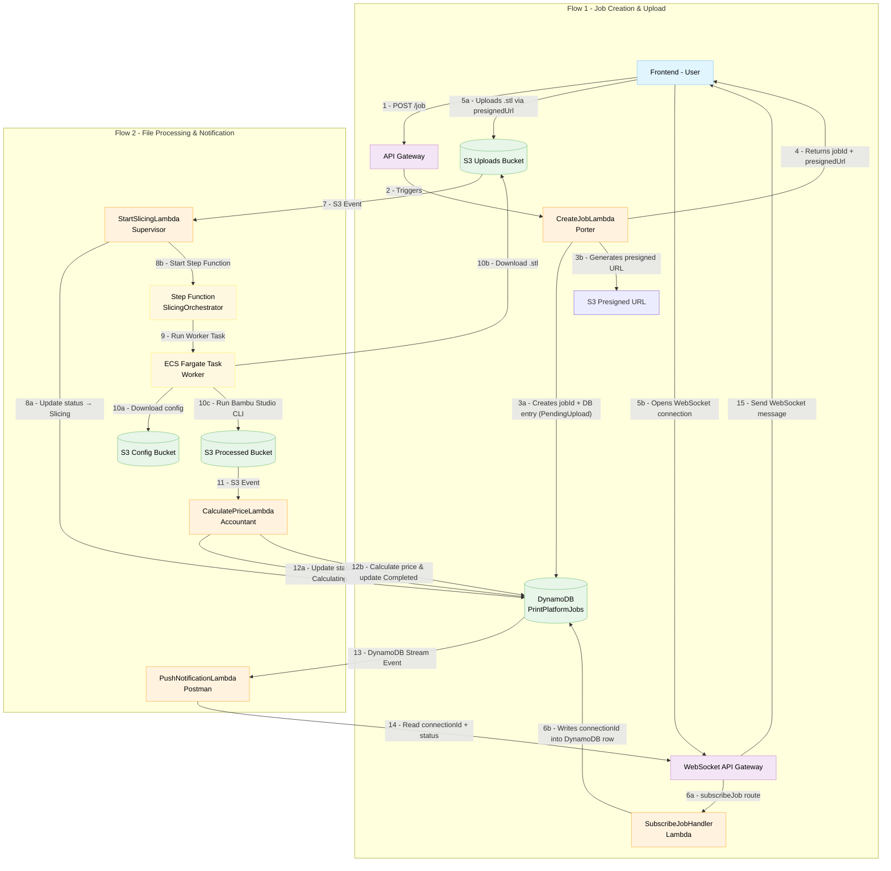

# 🧩 Project Architecture: Serverless 3D printing Price Estimator

This document describes the complete **serverless architecture** built on **AWS**.  
The system is divided into two main flows:

- **Flow 1:** Job Creation & Upload  
- **Flow 2:** Processing & Notification  

---

## 🧱 Flow 1: Job Creation & Upload

This flow covers how a user uploads a file and subscribes to job status updates.

1. **User (Frontend)** calls **REST API Gateway** (`POST /job`) with the file name.  
2. **API Gateway** triggers the `CreateJobLambda` (**Porter**).  
3. **CreateJobLambda** performs the following:
   - Generates a unique `jobId`.  
   - Creates a new entry in the **DynamoDB table** (`PrintPlatformJobs`) with a status of `PendingUpload`.  
   - Generates an **S3 Presigned URL** (temporary upload link) for the uploads bucket.  
4. The Lambda returns both `jobId` and `presignedUrl` to the frontend.  
5. The **Frontend** performs two actions simultaneously:
   - Uses the `presignedUrl` to upload the `.stl` file directly to the **S3 Uploads Bucket**.  
   - Opens a connection to the **WebSocket API Gateway**.  
6. The **WebSocket API** triggers the `SubscribeJobHandler` Lambda (on the `subscribeJob` route),  
   which writes the `connectionId` into the same DynamoDB row, associating the user with the job.  

---

## ⚙️ Flow 2: File Processing & Notification

This flow runs automatically once the upload from Flow 1 completes.

1. The **S3 Uploads Bucket** detects the new `.stl` file and (via an **S3 Event**) triggers the `StartSlicingLambda` (**Supervisor**).  
2. **StartSlicingLambda**:
   - Updates the job status in **DynamoDB** to `Slicing`.  
   - Starts the **Step Function** `"Manager"` (`SlicingOrchestrator`) and passes it the `jobId` and file paths.  
3. The **Step Function** runs the **ECS Fargate Task** (**Worker**).  
4. The **Fargate Task** (Docker container) performs:
   - Downloads config files from the **S3 Config Bucket**.  
   - Downloads the `.stl` file from the **S3 Uploads Bucket**.  
   - Executes the **Bambu Studio CLI**.  
   - Uploads the resulting `.3mf` file to the **S3 Processed Bucket**.  
5. The **S3 Processed Bucket** detects the new `.3mf` file and triggers the `CalculatePriceLambda` (**Accountant**).  
6. **CalculatePriceLambda**:
   - Updates the status in **DynamoDB** to `Calculating`.  
   - Downloads the `.3mf` file, unzips it, reads the XML, and calculates the printing price.  
   - Updates the status to `Completed` and writes `price`, `printTimeSeconds`, and related metadata.  
7. The **DynamoDB Stream** (always active):
   - Detects every status change (`Slicing`, `Calculating`, `Completed`).  
   - Triggers the `PushNotificationLambda` (**Postman**).  
8. **PushNotificationLambda**:
   - Reads the `connectionId` from the modified DynamoDB row.  
   - Sends a WebSocket message such as:  
     ```json
     { "status": "Completed", "price": 609 }
     ```
     via the **WebSocket API Gateway** to the specific user connection.  
9. The **User (Frontend)** receives the message via WebSocket and updates the progress bar and price display in real time.  

---

## 🧩 Summary

| Component | AWS Service | Role |
|------------|--------------|------|
| **Porter** | Lambda | Handles job creation and S3 presigned URL generation |
| **Supervisor** | Lambda | Starts the slicing workflow |
| **Manager (SlicingOrchestrator)** | Step Function | Coordinates slicing steps |
| **Worker** | ECS Fargate | Runs Bambu Studio CLI to generate `.3mf` files |
| **Accountant** | Lambda | Calculates printing cost from `.3mf` XML |
| **Postman** | Lambda | Sends WebSocket updates to clients |
| **SubscribeJobHandler** | Lambda | Associates frontend WebSocket connections with job IDs |
| **DynamoDB** | Database | Job state and user connection storage |
| **S3 (Uploads, Config, Processed)** | Storage | File and configuration management |
| **API Gateway (REST + WebSocket)** | API Layer | Communication between frontend and backend |

---

## 🔄 Status Lifecycle

**PendingUpload → Slicing → Calculating → Completed**  

---

## 🌐 Real-Time Example

1. User uploads a `.stl` model.  
2. The system slices it using **Bambu Studio CLI** inside an **ECS Fargate** task.  
3. When complete, a WebSocket message is pushed to the user with the final **price** and **print time**.

---

## 🏗️ Architecture Flow (Mermaid Diagram)
